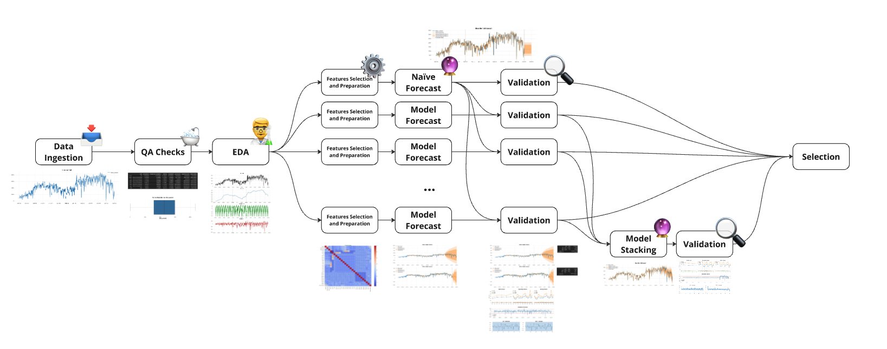
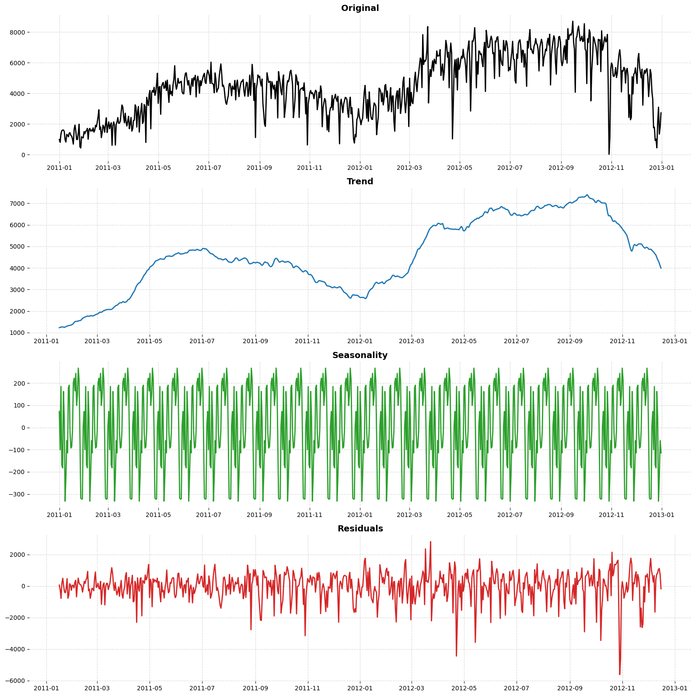
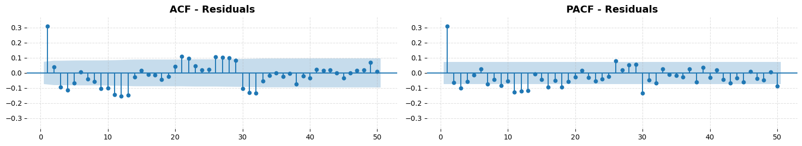
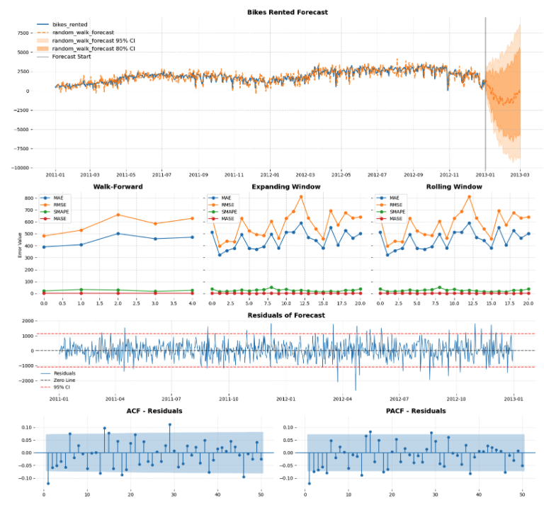
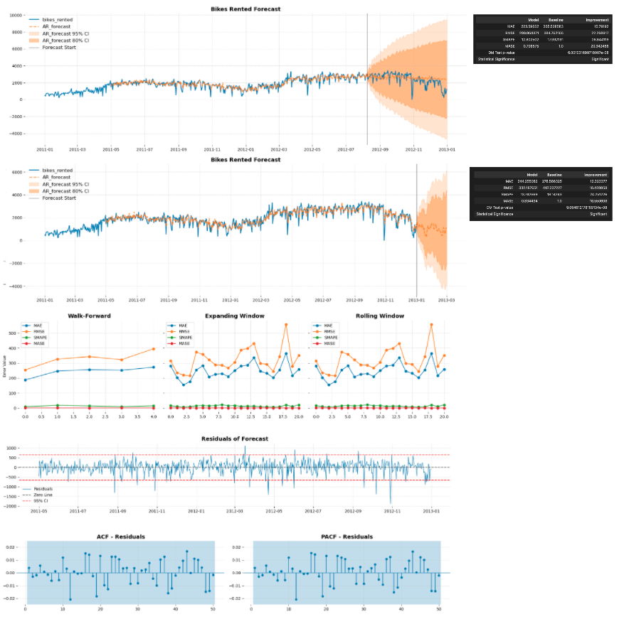
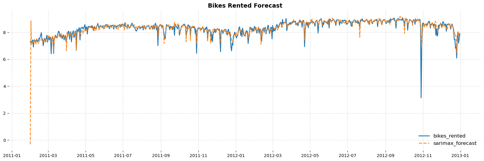
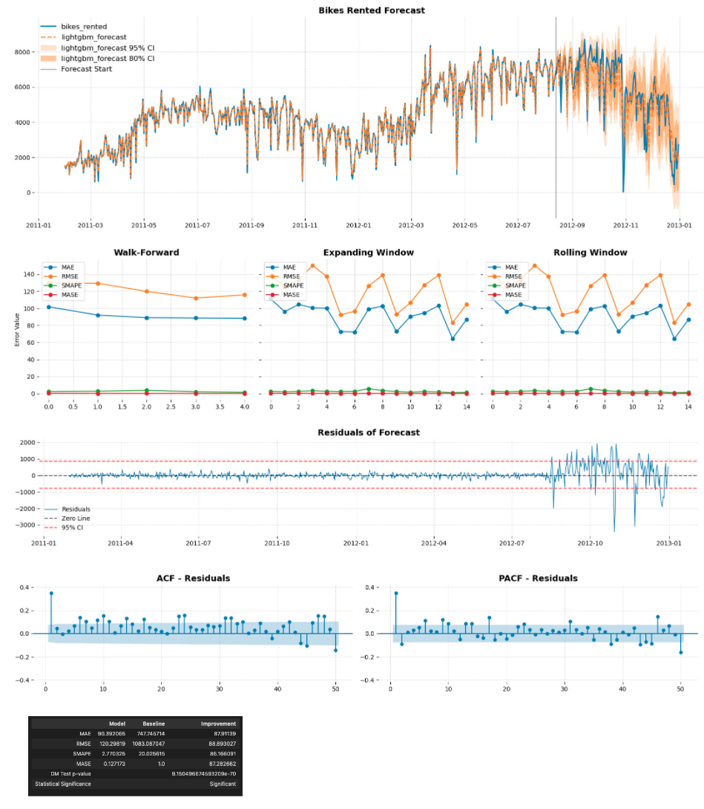

# Forecast Incremental Workflow



<br></br>

## Overview
**Forecast Incremental Workflow** is designed to implement a structured incremental approach to forecasting. Starting from basic methods (Naïve, Moving Average) and evolving towards advanced techniques (ARIMA, SARIMA, ETS, VAR, XGBoost), it systematically evaluates each model, identifying the most suitable forecasting approach based on data characteristics and validation metrics. The project uses daily rental bike data, combining endogenous and exogenous variables for comprehensive analysis.

## Problem Statement
Forecasting is crucial for operational planning but choosing the right model can be complex. This project provides an organized incremental approach that simplifies the forecasting process, comparing models from simple baseline methods to advanced multivariate and machine learning approaches, ensuring robust validation and clear interpretability.

## Technologies
- **pandas**: Data loading, cleaning, and preparation.
- **numpy/scipy**: Data manipulation and statistical tests.
- **statsmodels**: Statistical forecasting models (ARIMA, SARIMA, ETS, VAR).
- **scikit-learn/XGBoost/LightGBM/CatBoost**: Machine Learning models.
- **matplotlib**: Visualizing results and model validation.
- **Jupyter Notebooks**: Interactive analysis and prototyping.

## Project Structure

```bash
forecast-incremental-workflow/
│
├── data/                       # Data files
│   ├── bike+sharing+dataset.zip
│   ├── day.csv
│   └── hour.csv
│
├── img/                        # Images for documentation
│
├── notebooks/
│   ├── catboost_info/          # CatBoost logs and models
│   └── forecast_day.ipynb      # Exploratory analysis and model prototyping
│
├── src/
│   ├── base_forecast.py        # Baseline forecasting methods
│   ├── ml_forecast.py          # Machine learning model implementations
│   ├── statistical_forecast.py # Statistical forecasting implementations
│   ├── utils.py                # General utility functions
│   └── validation.py           # Model validation and comparison functions
│
├── requirements.txt            # Python dependencies
├── environment.yml             # Conda environment
├── README.md                   # Project documentation
└── .gitignore                  # Excluded files
```

## Workflow

### Data Loading and Cleaning
- Data is loaded and data types adjusted.
- Null values, duplicates, outliers are reviewed and addressed.
- Distribution analysis performed to ensure data quality.

### Exploratory Data Analysis (EDA)
- Verify stationarity, trend, persistence, and seasonality of the target variable.
- Analyze ACF and PACF to identify autoregressive characteristics.
- Decompose the series to isolate trend, seasonal, and residual components.
- Outlier detection to ensure data integrity.




### Feature Engineering and Transformation
- Option for temporal normalization to standardize month lengths.
- Automated checks on each feature to identify required transformations based on distribution and stationarity.
- Functions to apply transformations efficiently.


### Validation Framework
- Compare real vs forecasted values with confidence intervals.
- Calculate validation metrics (MAE, RMSE, SMAPE, MASE).
- Perform walk-forward, expanding window, and rolling window validations.
- Extract residuals, analyze their ACF and PACF.
- Baseline comparison using Diebold-Mariano test against Naïve model.
- Optional evaluation using the final 20% of data as test set.



### Forecasting Approaches

#### Base Models
- Naïve
- Random Walk
- Exponential Smoothing
- Holt's Linear Trend
- Holt-Winters
- Moving Average

#### Statistical Models
Iteratively optimized AR, ARMA, ARIMA, SARIMA. Best suited due to strong autoregressive characteristics of the dateset, evidenced by ACF/PACF.



#### Multivariate Models
- Feature encoding (one-hot) and generation (lags, moving averages).
- Collinearity and correlation checks.
- VARX, VECM, SARIMAX applied, with SARIMAX outperforming others due to complexity and cointegration constraints.



#### Machine Learning Models
- Linear Regression, Lasso
- Decision Tree, Random Forest
- XGBoost, LightGBM, CatBoost (with hyperparameter tuning and early stopping)

ML models demonstrated superior performance in the selected dataset, but exhibited higher susceptibility to overfitting, especially with limited data.



### Stacking and Model Integration
A stacking approach combining SARIMAX with top-performing ML models provided optimal results, balancing complexity with accuracy.


## Conclusions
Optimal forecasting balances simplicity and accuracy. Incremental improvements in accuracy must justify increased complexity.

<br></br>

---

📌 **Note:** Adjust file paths and configurations based on your local setup.
